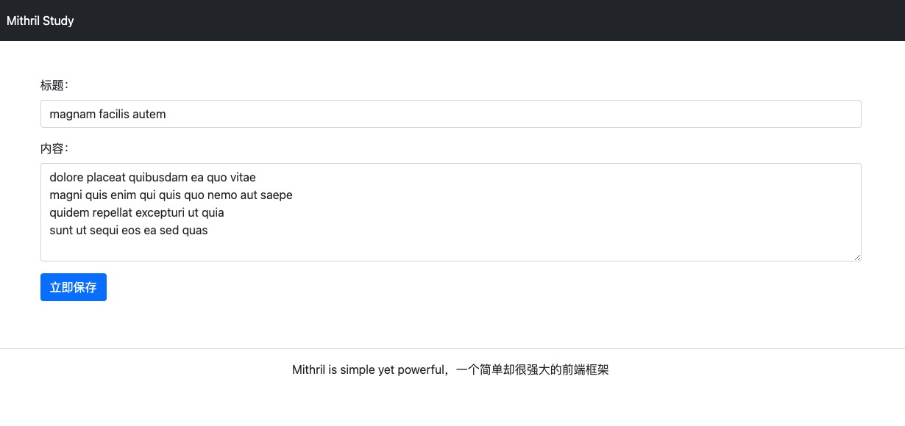

# mithril-study

一个 Mithril.js 学习代码仓库，使用 TypeScript 来构建的应用程序，记录学习过程中的代码

### 开始

To get the application up and running, do the following:

```
npm install
npm run dev
```

To generate files ready for deployment do this:

```
npm run build
```

To view the deployment-ready files in a browser:

```
npm run preview
```

### 效果



### 相关

项目中的 API 使用第三方的接口，https://jsonplaceholder.typicode.com

### 作者

-   官网：https://www.devpoint.cn
-   自媒体：
    -   掘金：https://juejin.cn/user/4406498333033918
    -   InfoQ：https://www.infoq.cn/u/devpoint/publish
    -   Twitter：https://twitter.com/DevPointCn
